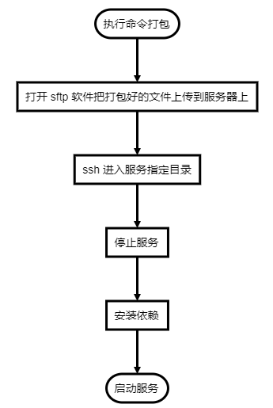
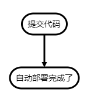
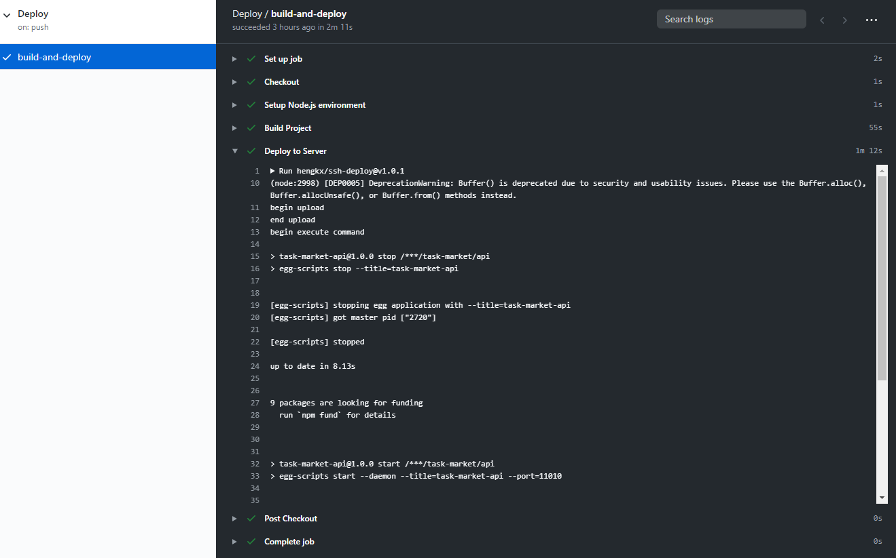

# 使用 JS 开发 Github Actions 实现自动部署到自己服务器

Github Actions 是一种全新的自动化开发工作流程的方法。

## 我为什么要使用 Github Actions

在没有使用 Github Actions 我部署程序是这样的。




使用 Github Actions 后。



## 为什么要自己写一个 Github Actions

1. 出来很久一直在用有点好奇是怎么处理的
2. 网上找了一些各种测试不成功(~~其实这才是主要原因哈哈~~)

## 开始动手了

### 目录结构

```
shh-deploy
|—— dist（编译后的目录可用直接运行）
|   |—— index.js
|—— lib（TS输出文件）
|—— src（源码文件）
|   |—— main.ts
|   |—— sftp.ts
|   |—— ssh-deploy.ts
|   action.yml（Github Actions的配置文件）
|   tsconfig.json（TS配置文件）
```

### 思考？

我们既然要实现自动部署。

1. 需要连接到服务器`ip`、`port`、`username`、`password`
1. 需要哪些文件(`source`)
1. 部署到服务器哪个目录下(`target`)
1. 文件复制完后需要执行安装依赖重启服务等等之内的工作(`after command`)

知道我们需要什么后，接下来就来看具体实现。

### Github Actions 具体实现

```yml
# action.yml 配置文件
name: 'SSH Auto Deploy' # 名称
description: 'ssh auto deploy' # 描述
author: 'hengkx' # 作者
branding:
  icon: 'crosshair' # 使用的是Feather的图标
  color: 'gray-dark' # 图标颜色
inputs: # 输入参数
  HOST: # 服务器地址
    description: 'remote host' # 参数描述
    required: true # 是否必填
  USERNAME: # 用户名
    description: 'username'
    required: true
  PASSWORD: # 密码
    description: 'password'
    required: true
  PORT: # 端口
    description: 'port'
    default: 22 # 默认值
  SOURCE: # 源目录
    description: 'local path'
    required: true
  TARGET: # 目标目录
    description: 'remote target'
    required: true
  AFTER_COMMAND: # 文件上传文成后执行
    description: 'upload success execute command'
runs: # 运行环境
  using: 'node12'
  main: 'dist/index.js' # 所执行的文件
```

有一点需要注意我们所提交的代码包含`node_modules`或者使用`@zeit/ncc`直接打包成可执行文件

```ts
// main.ts
import * as core from '@actions/core';
import { Client } from 'ssh2';
import Sftp from './sftp';

function exec(conn: Client, command: string) {
  return new Promise((resolve, reject) => {
    conn.exec(command, (err, stream) => {
      if (err) return reject(err);
      stream
        .on('close', function (code) {
          resolve(code);
        })
        .on('data', function (data) {
          core.info(data.toString());
        })
        .stderr.on('data', function (data) {
          core.error(data.toString());
        });
    });
  });
}

export async function run() {
  try {
    const host = core.getInput('HOST'); // 使用这个方法来获取我们在action.yml配置文件中设置的输入参数
    const port = parseInt(core.getInput('PORT'));
    const username = core.getInput('USERNAME');
    const password = core.getInput('PASSWORD');
    const src = core.getInput('SOURCE');
    const dst = core.getInput('TARGET');
    const afterCommand = core.getInput('AFTER_COMMAND');

    const conn = new Client();

    conn.on('ready', async () => {
      const sftp = new Sftp(conn);
      core.info('begin upload');
      await sftp.uploadDir(src, dst);
      core.info('end upload');
      let code: any = 0;
      if (afterCommand) {
        core.info('begin execute command'); // 输出一条日志
        code = await exec(conn, `cd ${dst} && ${afterCommand}`);
        core.info('end execute command');
      }
      conn.end();
      if (code === 1) {
        core.setFailed(`command execute failed`); // 告诉Github Actions执行失败了
      }
    });
    conn.connect({ host, port, username, password });
  } catch (error) {
    core.setFailed(error.message);
  }
}
```

我的项目配置文件

```yml
name: Deploy

on:
  push:
    branches: [master]

jobs:
  build-and-deploy:
    runs-on: ubuntu-latest

    steps:
      - name: Checkout
        uses: actions/checkout@master

      - name: Setup Node.js environment
        uses: actions/setup-node@v2.1.0
        with:
          node-version: '12.x'

      - name: Build Project
        run: yarn && yarn run ci

      - name: Deploy to Server
        uses: hengkx/ssh-deploy@v1.0.1
        with:
          USERNAME: ${{ secrets.DEPLOY_USER }}
          PASSWORD: ${{ secrets.DEPLOY_PASSWORD }}
          HOST: ${{ secrets.DEPLOY_HOST }}
          SOURCE: 'dist'
          TARGET: '/root/task-market/api'
          AFTER_COMMAND: 'npm run stop && npm install --production && npm run start'
```

运行效果图


[源码地址](https://github.com/hengkx/ssh-deploy)
