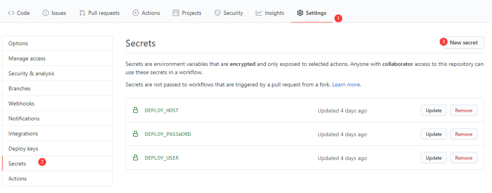

# 使用 JS 开发 Github Actions 实现自动部署前后台项目到自己服务器

不想看前面这么多废话的可以直接跳到[具体实现](#开始动手了)

## Github Actions 是什么？

说到 Github Actions 不得不提一下。

- **持续集成**（continuous integration）：高质量的让产品快速迭代
- **持续交付**（continuous delivery）：交付给团队测试
- **持续部署**（continuous deployment）：持续交付的下一步核心概念团队测试完成后自动部署到生产环境

CI/CD 是由很多操作组成的(如：执行单元测试、语法检查、打包、部署等等)。Github 把这些操作称为`action`，不同的项目很多的操作都是类似，Github 把这些操作整合成了一个[市场](https://github.com/marketplace?type=actions)允许大家发布或使用别人写好的`action`。

## Github Actions 的核心概念


### 操作（Action）

- `action`是工作流中最小的可移植模块
- 可以创建属于自己的`action`，使用 Github 社区提供的`action`以及自定义公开的`action`
- 在工作流中使用需要将其作为`steps`包含
- 使用是 用户名/仓储名/版本(或分支) 如：`actions/checkout@master`

### 事件（Event）

- 触发工作流运行的特定事件
- Github 本身事件`提交`、`创建问题`、`PR`等
- 使用 webhook 配置发生在外部的事件

[具体事件请参阅](https://docs.github.com/en/actions/reference/events-that-trigger-workflows)

### GitHub-hosted runner

| 虚拟主机环境         | YAML 工作流标签                    |
| -------------------- | ---------------------------------- |
| Windows Server 2019  | `windows-latest` or `windows-2019` |
| Ubuntu 20.04         | `ubuntu-20.04`                     |
| Ubuntu 18.04         | `ubuntu-latest` or `ubuntu-18.04`  |
| Ubuntu 16.04         | `ubuntu-16.04`                     |
| macOS Catalina 10.15 | `macos-latest` or `macos-10.15`    |

### 作业（Job）

- 在同一个运行程序上执行的一组步骤。
- 可以为作业在工作流文件中的运行方式定义依赖关系规则。
- 作业可以同时并行运行，也可以按顺序运行，具体取决于前一个作业的状态。例如，一个工作流可以有两个连续的作业来生成和测试代码，其中测试作业取决于生成作业的状态。如果生成作业失败，测试作业将不会运行。
- 对于 GitHub 托管的运行程序，工作流中的每个作业都在虚拟环境的新实例中运行。

[具体作业详细配置请参阅](https://docs.github.com/en/actions/reference/workflow-syntax-for-github-actions#jobs)

### 步骤（Step）

- 步骤是可以运行命令或操作的单个任务。
- 一个作业可配置**一个**或**多个**步骤。
- 作业中的每个步骤都在同一个运行器上执行，从而允许该作业中的操作使用**文件系统共享信息**。

### 工作流（Workflow）

- 可配置的自动化过程。测试、打包、发布或部署等等。
- 工作流由**一个**或**多个**作业组成，可以通过事件计划或激活。

### 工作流配置文件（Workflow file）

- 所有需要执行的工作流都必须放在 GitHub 存储库的根目录下的`.gitHub/workflows` 目录中。
- 需要使用`YAML`文件配置并以`.yml`后缀结尾

## 我为什么要使用 Github Actions

在没有使用 Github Actions 我部署程序是这样的。


## 如何使用？

使用 Github Actions 后。


## 为什么要自己写一个 Github Actions

1. 出来很久一直在用有点好奇是怎么处理的
2. 网上找了一些各种测试不成功(~~其实这才是主要原因哈哈~~)

## 开始动手了

### 目录结构

```
shh-deploy
|—— dist（编译后的目录可用直接运行）
|   |—— index.js
|—— lib（TS输出文件）
|—— src（源码文件）
|   |—— main.ts
|   |—— sftp.ts
|   |—— ssh-deploy.ts
|   action.yml（Github Actions的配置文件）
|   tsconfig.json（TS配置文件）
```

### 思考？

我们既然要实现自动部署。

1. 需要连接到服务器`ip`、`port`、`username`、`password`
1. 需要哪些文件(`source`)
1. 部署到服务器哪个目录下(`target`)
1. 文件复制完后需要执行安装依赖重启服务等等之内的工作(`after command`)

知道我们需要什么后，接下来就来看具体实现。

### Github Actions 具体实现

```yml
# action.yml 配置文件
name: 'SSH Auto Deploy' # 名称
description: 'ssh auto deploy' # 描述
author: 'hengkx' # 作者
branding:
  icon: 'crosshair' # 使用的是Feather的图标
  color: 'gray-dark' # 图标颜色
inputs: # 输入参数
  HOST: # 服务器地址
    description: 'remote host' # 参数描述
    required: true # 是否必填
  USERNAME: # 用户名
    description: 'username'
    required: true
  PASSWORD: # 密码
    description: 'password'
    required: true
  PORT: # 端口
    description: 'port'
    default: 22 # 默认值
  SOURCE: # 源目录
    description: 'local path'
    required: true
  TARGET: # 目标目录
    description: 'remote target'
    required: true
  AFTER_COMMAND: # 文件上传文成后执行
    description: 'upload success execute command'
runs: # 运行环境
  using: 'node12'
  main: 'dist/index.js' # 所执行的文件
```

有一点需要注意我们所提交的代码包含`node_modules`或者使用`@zeit/ncc`直接打包成可执行文件

```ts
// main.ts
import * as core from '@actions/core';
import { Client } from 'ssh2';
import Sftp from './sftp';

function exec(conn: Client, command: string) {
  return new Promise((resolve, reject) => {
    conn.exec(command, (err, stream) => {
      if (err) return reject(err);
      stream
        .on('close', function (code) {
          resolve(code);
        })
        .on('data', function (data) {
          core.info(data.toString());
        })
        .stderr.on('data', function (data) {
          core.error(data.toString());
        });
    });
  });
}

export async function run() {
  try {
    const host = core.getInput('HOST'); // 使用这个方法来获取我们在action.yml配置文件中设置的输入参数
    const port = parseInt(core.getInput('PORT'));
    const username = core.getInput('USERNAME');
    const password = core.getInput('PASSWORD');
    const src = core.getInput('SOURCE');
    const dst = core.getInput('TARGET');
    const afterCommand = core.getInput('AFTER_COMMAND');
    // 下面为ssh链接服务器上传文件并执行命令
    const conn = new Client();

    conn.on('ready', async () => {
      const sftp = new Sftp(conn);
      core.info('begin upload');
      await sftp.uploadDir(src, dst);
      core.info('end upload');
      let code: any = 0;
      if (afterCommand) {
        core.info('begin execute command'); // 输出一条日志
        code = await exec(conn, `cd ${dst} && ${afterCommand}`);
        core.info('end execute command');
      }
      conn.end();
      if (code === 1) {
        core.setFailed(`command execute failed`); // 告诉Github Actions执行失败了
      }
    });
    conn.connect({ host, port, username, password });
  } catch (error) {
    core.setFailed(error.message);
  }
}
```

我的项目配置文件

```yml
name: Deploy

on: # 在master分支上提交代码执行
  push:
    branches: [master]

jobs: # 作业
  build-and-deploy: # 作业名称
    runs-on: ubuntu-latest # 运行的环境

    steps: #步骤
      - name: Checkout # 步骤名
        uses: actions/checkout@master # 所使用的action

      - name: Setup Node.js environment
        uses: actions/setup-node@v2.1.0
        with:
          node-version: '12.x'

      - name: Build Project
        run: yarn && yarn run ci

      - name: Deploy to Server
        uses: hengkx/ssh-deploy@v1.0.1
        with: # 以下为参数
          USERNAME: ${{ secrets.DEPLOY_USER }} # 为了用户信息安全对敏感数据可以在secrets中配置请看下图
          PASSWORD: ${{ secrets.DEPLOY_PASSWORD }}
          HOST: ${{ secrets.DEPLOY_HOST }}
          SOURCE: 'dist'
          TARGET: '/root/task-market/api'
          AFTER_COMMAND: 'npm run stop && npm install --production && npm run start'
```



[源码地址](https://github.com/hengkx/ssh-deploy)

## 参考链接

- [GitHub Actions 官方文档](https://docs.github.com/en/actions)
- [GitHub Actions 入门教程](http://www.ruanyifeng.com/blog/2019/09/getting-started-with-github-actions.html)
